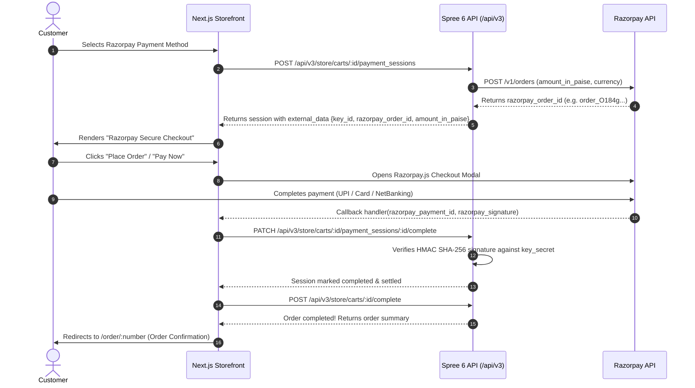

# Fresh Storefront Implementation Guide: Razorpay Payment Gateway (Spree 6 / Next.js)

This guide provides a comprehensive, production-ready, step-by-step walkthrough to integrate **Razorpay** into a **fresh, untouched Spree 6 Next.js Storefront** (`apps/storefront`).

Whether you are a beginner developer or an autonomous AI agent, follow this guide to implement Razorpay Standard Checkout (UPI, Credit/Debit Cards, NetBanking, and Wallets) with cryptographic HMAC-SHA256 signature verification.

---

## 1. Summary of Changes (4 Files)

| Action | Path | Purpose |
| :--- | :--- | :--- |
| **NEW** | `apps/storefront/public/secured-by-razorpay.svg` | Official Razorpay security badge for trust display |
| **MODIFY** | `apps/storefront/src/lib/utils/payment-gateway.ts` | Register `"razorpay"` gateway ID and Spree type mappings |
| **NEW** | `apps/storefront/src/components/checkout/RazorpayPaymentForm.tsx` | Razorpay modal launcher, `checkout.js` loader, and signature handler |
| **MODIFY** | `apps/storefront/src/components/checkout/PaymentSection.tsx` | Mount Razorpay payment form inside checkout gateway switcher |

---

## 2. Step 1: Add the Secured by Razorpay SVG Badge

Create a new SVG file at `apps/storefront/public/secured-by-razorpay.svg` to display the official trust badge on the payment form.

**File:** `apps/storefront/public/secured-by-razorpay.svg`

```xml
<svg xmlns="http://www.w3.org/2000/svg" fill="none" viewBox="0 0 120 17"><path fill="#192839" d="M4.86 6.84A1.11 1.11 0 0 0 4.34 6a2 2 0 0 0-1.12-.3c-.32 0-.6.06-.84.16s-.43.25-.56.43a1.03 1.03 0 0 0-.06 1.12c.1.14.21.26.36.35.15.09.3.16.46.22l.45.14.73.2c.2.05.4.12.64.2.23.1.45.21.67.36a1.66 1.66 0 0 1 .74 1.44c0 .4-.1.75-.3 1.07-.21.31-.51.57-.9.75-.4.2-.87.28-1.43.28-.52 0-.97-.08-1.35-.25a2.2 2.2 0 0 1-.9-.7 2 2 0 0 1-.36-1.05h.9c.03.28.12.5.28.68.17.18.37.31.62.4a2.5 2.5 0 0 0 1.71-.03c.27-.12.49-.27.64-.47.16-.2.24-.43.24-.7a.85.85 0 0 0-.2-.58 1.49 1.49 0 0 0-.54-.37 5.6 5.6 0 0 0-.71-.25l-.9-.25a3.33 3.33 0 0 1-1.35-.7c-.33-.3-.5-.7-.5-1.2 0-.4.12-.76.34-1.06.22-.3.52-.54.9-.71.37-.17.79-.26 1.25-.26.47 0 .89.09 1.25.26.37.16.66.39.87.68.21.29.33.62.34.98h-.85Zm4.57 5.57a2.34 2.34 0 0 1-2.24-1.33c-.2-.42-.3-.9-.3-1.47 0-.56.1-1.05.3-1.48.21-.42.5-.76.86-1a2.59 2.59 0 0 1 2.13-.22 2.09 2.09 0 0 1 1.3 1.3c.14.35.21.78.21 1.29v.35h-4.2v-.72h3.35c0-.3-.06-.58-.19-.82a1.4 1.4 0 0 0-1.3-.79 1.54 1.54 0 0 0-1.43.89c-.13.26-.2.55-.2.85v.48c0 .41.08.76.22 1.05.14.28.34.5.6.65a1.84 1.84 0 0 0 1.49.12c.18-.06.33-.15.46-.28.13-.13.23-.29.3-.47l.81.22a1.8 1.8 0 0 1-.43.73c-.2.2-.45.36-.74.48-.3.11-.63.17-1 .17Zm5.75 0c-.51 0-.95-.12-1.32-.36a2.36 2.36 0 0 1-.85-1c-.2-.42-.3-.9-.3-1.45 0-.56.1-1.04.3-1.47.21-.42.5-.76.86-1 .37-.24.8-.36 1.3-.36a2.16 2.16 0 0 1 1.79.81c.2.26.32.55.37.9h-.84a1.28 1.28 0 0 0-1.3-.95 1.48 1.48 0 0 0-1.44.96c-.14.3-.2.67-.2 1.08 0 .42.06.79.2 1.1a1.47 1.47 0 0 0 1.43.99c.22 0 .42-.04.6-.12a1.22 1.22 0 0 0 .7-.83h.85a1.94 1.94 0 0 1-1.1 1.48c-.3.15-.65.22-1.05.22Zm6.8-2.34V6.84h.85v5.46h-.84v-.93h-.06a1.72 1.72 0 0 1-1.62 1c-.34 0-.64-.08-.9-.23a1.57 1.57 0 0 1-.63-.68c-.15-.3-.23-.69-.23-1.15V6.84h.84v3.41c0 .4.11.72.33.95.23.24.51.36.86.36a1.43 1.43 0 0 0 1.4-1.5Zm2.38 2.23V6.84h.81v.83h.06c.1-.27.28-.5.54-.66.26-.17.55-.25.88-.25a9.33 9.33 0 0 1 .44.01v.85a2.48 2.48 0 0 0-.51-.05c-.27 0-.5.05-.71.16a1.22 1.22 0 0 0-.67 1.11v3.46h-.84Zm5.84.11a2.34 2.34 0 0 1-2.24-1.33c-.2-.42-.3-.9-.3-1.47 0-.56.1-1.05.3-1.48.21-.42.5-.76.86-1a2.59 2.59 0 0 1 2.13-.22 2.09 2.09 0 0 1 1.3 1.3c.14.35.21.78.21 1.29v.35h-4.2v-.72h3.35c0-.3-.06-.58-.19-.82a1.4 1.4 0 0 0-1.3-.79 1.54 1.54 0 0 0-1.43.89c-.13.26-.2.55-.2.85v.48c0 .41.08.76.22 1.05.15.28.35.5.6.65a1.84 1.84 0 0 0 1.49.12c.18-.06.33-.15.46-.28.13-.13.23-.29.3-.47l.82.22a1.8 1.8 0 0 1-.43.73c-.2.2-.45.36-.75.48-.3.11-.63.17-1 .17Zm5.6 0a2.14 2.14 0 0 1-2.03-1.32c-.2-.43-.29-.93-.29-1.5 0-.58.1-1.08.3-1.5a2.16 2.16 0 0 1 2.03-1.32c.35 0 .64.06.84.18.21.11.37.25.48.4l.26.36h.07V5.02h.84v7.28h-.81v-.84h-.1l-.27.38c-.11.14-.27.28-.48.4-.21.11-.5.17-.84.17Zm.1-.75c.35 0 .63-.09.86-.27.23-.17.41-.42.53-.73.12-.32.18-.68.18-1.09 0-.4-.06-.76-.18-1.07-.11-.3-.29-.55-.52-.72a1.4 1.4 0 0 0-.86-.26c-.36 0-.65.1-.89.28-.23.18-.4.42-.53.73a3.1 3.1 0 0 0-.17 1.04 3 3 0 0 0 .18 1.06c.12.31.3.56.53.75.24.19.53.28.88.28Zm6.97.64V5.02h.84v2.69h.07l.26-.36c.1-.15.27-.29.47-.4.21-.12.5-.18.85-.18a2.17 2.17 0 0 1 2.03 1.32c.2.42.3.92.3 1.5 0 .57-.1 1.07-.3 1.5-.2.42-.47.74-.81.98-.35.23-.75.34-1.2.34-.36 0-.64-.06-.85-.17a1.56 1.56 0 0 1-.49-.4l-.26-.38h-.1v.84h-.8Zm.83-2.73c0 .41.06.77.18 1.09.12.31.3.56.53.73.23.18.51.27.85.27.35 0 .64-.1.88-.28.23-.19.41-.44.53-.75.12-.32.18-.67.18-1.06 0-.38-.06-.73-.18-1.04a1.6 1.6 0 0 0-.53-.73 1.4 1.4 0 0 0-.88-.28 1.4 1.4 0 0 0-1.39.98c-.11.3-.17.66-.17 1.07Zm5.61 4.76a1.83 1.83 0 0 1-.6-.1l.2-.74c.31.08.57.08.77 0 .2-.09.38-.33.53-.74l.16-.42-2.02-5.49h.9l1.51 4.35h.06l1.5-4.35.92.02-2.32 6.23c-.1.28-.23.5-.39.7a1.52 1.52 0 0 1-1.22.54Z"/><g fill-rule="evenodd" clip-path="url(#a)" clip-rule="evenodd"><path fill="#0E2562" d="M72.95 6.19c.21-.78.12-1.38-.27-1.8-.38-.4-1.06-.62-2.04-.62h-3.72L64.67 12h1.81l.9-3.31h1.2c.26 0 .47.04.63.12.15.09.24.24.27.45L69.8 12h1.94l-.32-2.55c-.06-.57-.32-.9-.8-1 .6-.18 1.1-.46 1.5-.85.4-.4.68-.86.83-1.41Zm-1.73.05c-.1.37-.3.64-.59.81-.29.17-.7.26-1.22.26h-1.67l.59-2.15H70c.52 0 .88.09 1.08.26.2.17.24.45.14.82Zm6.92-.1-.23.83a1.3 1.3 0 0 0-.57-.72A1.92 1.92 0 0 0 76.3 6a3 3 0 0 0-1.47.39c-.47.25-.88.62-1.23 1.09-.35.47-.61 1-.77 1.6-.17.6-.2 1.14-.1 1.6.1.45.3.8.64 1.05.33.25.75.37 1.27.37a2.85 2.85 0 0 0 2.14-.96l-.24.87h1.75l1.6-5.86h-1.75Zm-.8 2.91c-.15.56-.38.98-.7 1.27-.3.3-.69.44-1.12.44-.45 0-.75-.14-.91-.43-.17-.29-.17-.7-.02-1.26.15-.54.39-.97.71-1.28.33-.3.71-.46 1.15-.46.44 0 .74.15.9.44.15.3.15.73 0 1.28Zm8.86-2.91h-5.1l-.35 1.3h2.96l-3.92 3.34-.33 1.22h5.25l.36-1.3H81.9l3.97-3.38.32-1.18Zm5.5.22c-.4-.25-.92-.37-1.55-.37s-1.22.12-1.76.37c-.55.24-1 .6-1.39 1.06-.38.46-.65 1-.82 1.62a3.04 3.04 0 0 0-.06 1.62c.13.46.4.81.8 1.06.41.25.93.37 1.57.37a4.09 4.09 0 0 0 3.12-1.43c.38-.46.66-1 .82-1.62.17-.62.2-1.16.06-1.62-.13-.46-.4-.82-.8-1.06Zm-1.03 2.68a2.72 2.72 0 0 1-.7 1.3c-.3.28-.68.42-1.12.42-.92 0-1.22-.57-.9-1.72.15-.57.38-1 .7-1.29.31-.29.7-.43 1.14-.43.44 0 .73.14.88.43.16.29.16.72 0 1.29Zm20.14-2.9-.22.83c-.1-.3-.3-.54-.57-.72a1.92 1.92 0 0 0-1.05-.26c-.5 0-1 .13-1.47.39-.47.25-.88.62-1.23 1.09-.35.47-.6 1-.77 1.6-.17.6-.2 1.14-.1 1.6.1.45.31.8.64 1.05s.75.37 1.27.37a2.85 2.85 0 0 0 2.14-.96l-.23.87h1.75l1.6-5.86h-1.76Zm-.8 2.91c-.14.56-.38.98-.69 1.27-.31.3-.7.44-1.13.44-.45 0-.75-.14-.91-.43-.16-.29-.17-.7-.02-1.26.15-.54.39-.97.72-1.28.32-.3.7-.46 1.14-.46.44 0 .74.15.9.44.15.3.15.73 0 1.28ZM97.94 7.71l.45-1.6a1.34 1.34 0 0 0-.6-.11 2.44 2.44 0 0 0-1.98 1l.23-.86H94.3L92.7 12h1.77l.83-3.06c.13-.45.34-.8.66-1.05.31-.25.7-.38 1.18-.38.29 0 .56.07.81.2Zm6.19-1.33a1.98 1.98 0 0 0-1.26-.39 2.82 2.82 0 0 0-2.26 1.12v-.04l.3-.93h-1.73l-.44 1.62-.01.06-1.83 6.68h1.78l.92-3.36c.09.3.27.53.56.7.28.17.63.25 1.04.25a3.2 3.2 0 0 0 1.48-.36c.47-.25.87-.6 1.22-1.06.34-.46.6-1 .76-1.6.16-.6.2-1.13.1-1.6-.1-.47-.3-.83-.63-1.1Zm-1.24 2.7a2.6 2.6 0 0 1-.7 1.25 1.6 1.6 0 0 1-1.13.44c-.44 0-.74-.15-.9-.44-.16-.3-.16-.72 0-1.27.14-.56.38-.99.7-1.28.32-.3.7-.45 1.14-.45.43 0 .72.16.88.47.15.3.15.73 0 1.28Zm17.03-2.94h-1.73l-.29.4-.07.09-.03.04-2.27 3.1-.47-3.63h-1.85l.94 5.53-2.08 2.83h1.85l.5-.7.05-.06.58-.82.02-.03 2.63-3.66 2.22-3.09Z"/><path fill="#3395FF" d="m60.1 4.72-.52 1.92 3.04-1.93-2 7.3h2.03l2.94-10.78-5.48 3.49Z"/><path fill="#0E2562" d="M56.84 8.93 56 12h4.14l1.7-6.24-5 3.17Z"/></g><defs><clipPath id="a"><path fill="#fff" d="M56 0h64v16.59H56z"/></clipPath></defs></svg>
```

---

## 3. Step 2: Register Gateway ID in `payment-gateway.ts`

Update the gateway mapping utility so the storefront recognizes Spree's Razorpay gateway class names and resolves them to `"razorpay"`.

**File:** `apps/storefront/src/lib/utils/payment-gateway.ts`

### 1. Update `GatewayId` type definition:
Add `"razorpay"` to the `GatewayId` union:

```typescript
export type GatewayId = "stripe" | "adyen" | "paypal" | "razorpay" | "unknown";
```

### 2. Update `GATEWAY_TYPE_MAP`:
Add the mappings for Spree Razorpay payment method types:

```typescript
const GATEWAY_TYPE_MAP: Record<string, GatewayId> = {
  // Stripe
  stripe: "stripe",
  "SpreeStripe::Gateway": "stripe",

  // Adyen
  adyen: "adyen",
  "SpreeAdyen::Gateway": "adyen",

  // PayPal
  paypal_checkout: "paypal",
  paypal: "paypal",
  "SpreePaypalCheckout::Gateway": "paypal",

  // Razorpay
  razorpay: "razorpay",
  razorpay_checkout: "razorpay",
  "SpreeRazorpay::Gateway": "razorpay",
  "SpreeRazorpayCheckout::Gateway": "razorpay",
  "Spree::Gateway::RazorpayGateway": "razorpay",
};
```

---

## 4. Step 3: Create `RazorpayPaymentForm.tsx` Component

Create the dedicated Razorpay payment form component. This component:
1. Loads the official Razorpay JS SDK (`https://checkout.razorpay.com/v1/checkout.js`).
2. Prefills customer name, email, and phone number from the session external data.
3. Initializes the `Razorpay` modal when the user submits the checkout form via the imperative `confirmPayment` handle.
4. Submits the cryptographic signature (`razorpay_payment_id`, `razorpay_order_id`, and `razorpay_signature`) to `completeCheckoutPaymentSession` upon successful authorization.

**File:** `apps/storefront/src/components/checkout/RazorpayPaymentForm.tsx`

```tsx
"use client";

import Image from "next/image";
import Script from "next/script";
import { useCallback, useEffect, useRef } from "react";
import { completeCheckoutPaymentSession } from "@/lib/data/payment";

export interface RazorpayPaymentFormHandle {
  confirmPayment: (returnUrl: string) => Promise<{ error?: string }>;
  fetchUpdates: () => Promise<void>;
}

interface RazorpayPaymentFormProps {
  cartId: string;
  sessionExternalData: Record<string, unknown>;
  paymentSessionId: string;
  currency: string;
  onReady: (handle: RazorpayPaymentFormHandle) => void;
  onApproved: () => void;
}

declare global {
  interface Window {
    Razorpay: any;
  }
}

export function RazorpayPaymentForm({
  cartId,
  sessionExternalData,
  paymentSessionId,
  currency,
  onReady,
  onApproved,
}: RazorpayPaymentFormProps) {
  const approvedRef = useRef(false);

  const confirmPayment = useCallback(
    async (_returnUrl: string): Promise<{ error?: string }> => {
      if (approvedRef.current) {
        return {};
      }

      if (typeof window === "undefined" || !window.Razorpay) {
        return { error: "Razorpay SDK is still loading. Please try again in a moment." };
      }

      const keyId = sessionExternalData.key_id as string;
      const orderId = (sessionExternalData._external_id ||
        sessionExternalData.razorpay_order_id) as string;
      const amount = (sessionExternalData.amount_in_paise ||
        sessionExternalData.amount) as number;

      const customerName = (sessionExternalData.customer_name as string) || "";
      const customerEmail = (sessionExternalData.customer_email as string) || "";
      const customerPhone = (sessionExternalData.customer_phone as string) || "";

      return new Promise<{ error?: string }>((resolve) => {
        let isResolved = false;

        const options = {
          key: keyId,
          amount: amount,
          currency: (currency || "INR").toUpperCase(),
          order_id: orderId,
          name: "Store Checkout",
          description: "Order Payment",
          prefill: {
            name: customerName,
            email: customerEmail,
            contact: customerPhone,
          },
          readonly: {
            email: Boolean(customerEmail),
            contact: Boolean(customerPhone),
          },
          handler: async function (response: any) {
            if (isResolved) return;
            isResolved = true;

            try {
              // Complete session in Spree 6 backend with Razorpay payment details & signature
              const result = await completeCheckoutPaymentSession(
                cartId,
                paymentSessionId,
                {
                  external_data: {
                    razorpay_payment_id: response.razorpay_payment_id,
                    razorpay_order_id: response.razorpay_order_id || orderId,
                    razorpay_signature: response.razorpay_signature,
                  },
                },
              );

              if (result.success) {
                approvedRef.current = true;
                onApproved();
                resolve({});
              } else {
                resolve({ error: result.error || "Failed to confirm Razorpay payment." });
              }
            } catch (err: any) {
              resolve({
                error: err instanceof Error ? err.message : "Payment processing error.",
              });
            }
          },
          modal: {
            ondismiss: function () {
              if (!isResolved) {
                isResolved = true;
                resolve({
                  error: "Payment window closed. Please complete payment to place order.",
                });
              }
            },
          },
        };

        try {
          const rzp = new window.Razorpay(options);
          rzp.on("payment.failed", function (response: any) {
            if (!isResolved) {
              isResolved = true;
              resolve({
                error: response.error?.description || "Razorpay payment failed.",
              });
            }
          });
          rzp.open();
        } catch (err: any) {
          if (!isResolved) {
            isResolved = true;
            resolve({
              error: err instanceof Error ? err.message : "Failed to open Razorpay modal.",
            });
          }
        }
      });
    },
    [cartId, sessionExternalData, paymentSessionId, currency, onApproved],
  );

  const fetchUpdates = useCallback(async () => {}, []);

  const onReadyRef = useRef(onReady);
  onReadyRef.current = onReady;
  const confirmPaymentRef = useRef(confirmPayment);
  confirmPaymentRef.current = confirmPayment;
  const fetchUpdatesRef = useRef(fetchUpdates);
  fetchUpdatesRef.current = fetchUpdates;

  useEffect(() => {
    onReadyRef.current({
      confirmPayment: (...args) => confirmPaymentRef.current(...args),
      fetchUpdates: (...args) => fetchUpdatesRef.current(...args),
    });
  }, []);

  return (
    <div className="p-4 space-y-3">
      <Script src="https://checkout.razorpay.com/v1/checkout.js" />
      <div className="flex flex-col gap-3 text-sm text-gray-700 bg-white border rounded-md p-4 shadow-sm">
        <div>
          <p className="font-medium text-gray-900">Razorpay Secure Checkout</p>
          <p className="text-xs text-gray-500 mt-1">
            Clicking &quot;Pay Now&quot; below will open Razorpay to complete your payment with UPI, Cards, NetBanking, or Wallets.
          </p>
        </div>
        <div className="mt-1">
          <Image
            src="/secured-by-razorpay.svg"
            alt="Secured by Razorpay"
            width={135}
            height={23}
            className="h-auto w-[135px]"
          />
        </div>
      </div>
    </div>
  );
}
```

---

## 5. Step 4: Mount Razorpay in `PaymentSection.tsx`

Mount the component in `PaymentSection.tsx` inside the gateway switch block.

**File:** `apps/storefront/src/components/checkout/PaymentSection.tsx`

### 1. Import component and types:
At the top of the file:

```tsx
import {
  RazorpayPaymentForm,
  type RazorpayPaymentFormHandle,
} from "@/components/checkout/RazorpayPaymentForm";
```

### 2. Add handle to `gatewayHandleRef`:
Update the `useRef` type definition:

```tsx
const gatewayHandleRef = useRef<
  | StripePaymentFormHandle
  | AdyenPaymentFormHandle
  | PayPalPaymentFormHandle
  | RazorpayPaymentFormHandle
  | null
>(null);
```

### 3. Add handle to `handleGatewayReady`:
Update `handleGatewayReady` callback parameter:

```tsx
const handleGatewayReady = useCallback(
  (
    handle:
      | StripePaymentFormHandle
      | AdyenPaymentFormHandle
      | PayPalPaymentFormHandle
      | RazorpayPaymentFormHandle,
  ) => {
    gatewayHandleRef.current = handle;
  },
  [],
);
```

### 4. Add the `"razorpay"` case to the JSX Switch block:
Inside the gateway rendering switch statement (`switch (pmGatewayId)` or `switch (gatewayId)`):

```tsx
case "razorpay": {
  return (
    <div className="p-4">
      <RazorpayPaymentForm
        key={paymentSessionId ?? "razorpay"}
        cartId={cart.id}
        sessionExternalData={ext}
        paymentSessionId={paymentSessionId!}
        currency={cart.currency}
        onReady={handleGatewayReady}
        onApproved={handleGatewayApproved}
      />
    </div>
  );
}
```

---

## 6. Step 5: Backend Setup & Spree Admin Configuration

### 1. Add Gem to Backend `Gemfile`

In `server/Gemfile`:

```ruby
gem 'spree_razorpay', path: 'plugins/razorpay'
```

Run bundle install:

```bash
bundle install
```

### 2. Auto-Install & Configure via Console (Recommended)

Run the automated install task to create and configure the Razorpay payment method across your stores:

```bash
# Quick default installation:
bin/rails spree_razorpay:install

# Or pass your credentials directly:
RAZORPAY_KEY_ID="rzp_test_..." RAZORPAY_KEY_SECRET="your_secret" bin/rails spree_razorpay:install

# Or via Rails Generator:
bin/rails generate spree_razorpay:install --key-id="rzp_test_..." --key-secret="your_secret"
```

---

### 3. Manual Configuration in Spree Admin (Alternative)

If you prefer to configure manually via the Spree Admin UI:

1. Open your Spree Admin Dashboard (`/admin` or `http://localhost:5173`).
2. Navigate to **Settings > Payments > New Payment Method**.
3. Configure the fields:
   - **Provider**: Select `SpreeRazorpay::Gateway`
   - **Name**: `Razorpay (UPI / Cards / NetBanking)`
   - **Active**: `Yes`
   - **Storefront Visible**: `Yes`
4. Under **Gateway Preferences**:
   - **Key ID**: `rzp_test_...` (from your Razorpay Dashboard)
   - **Key Secret**: Your Razorpay Secret Key
   - **Auto Capture**: Checked (`true`)
5. Click **Save**.


---

## 7. How the Payment Flow Works (End-to-End Architecture)



---

## 8. Testing in Razorpay Sandbox (Test Mode)

1. Use your Razorpay Test Key ID (`rzp_test_...`) and Secret.
2. In checkout, select **Razorpay** and click **Place Order**.
3. In the Razorpay modal:
   - **UPI**: Enter `success@razorpay` to simulate a successful payment or `failure@razorpay` to test failure handling.
   - **Cards**: Use test card `4111 1111 1111 1111` with any future expiry and `123` CVV, and click **Success** in the OTP simulation screen.
   - **NetBanking**: Select any test bank (e.g. HDFC, SBI) and click **Success**.

---

## 9. Troubleshooting & Edge Cases

1. **`Razorpay SDK is still loading` error:**
   - Ensure `<Script src="https://checkout.razorpay.com/v1/checkout.js" />` is mounted and not blocked by content security policies or ad-blockers.
2. **Signature Verification Mismatch (`Generated != Received`):**
   - Verify that the `Key Secret` in Spree Admin Settings > Payments matches the exact Key Secret corresponding to the `Key ID` in your Razorpay Dashboard.
3. **Paise vs Rupees Calculation:**
   - Spree backend automatically converts standard currency unit to paise (`amount * 100`). Do not multiply by 100 again in the frontend.
4. **Popup / Modal Closed by User:**
   - Handled gracefully by `modal.ondismiss` callback, returning an error message so the customer can retry without losing their cart.
